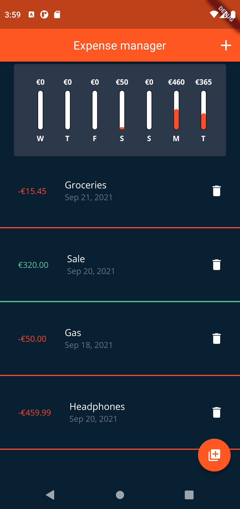
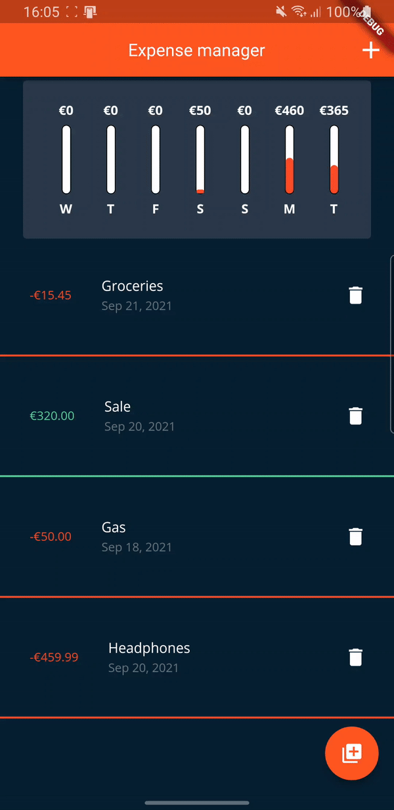
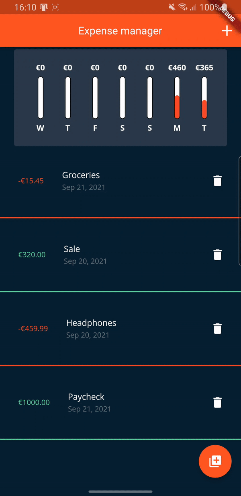

# personal_expenses_app

A Flutter project from Maximilian Schwarzmüller's [course](https://www.udemy.com/course/learn-flutter-dart-to-build-ios-android-apps) on Flutter and Dart.

This project is meant to show core Flutter functions and widgets on a small scale **Expense Manager App**

## Main Screen

## List of transactions and delete function

## Adding a new transaction
Adding a new transaction is done using SingleChildScrollView Widget after pressing the button in the bottom right

